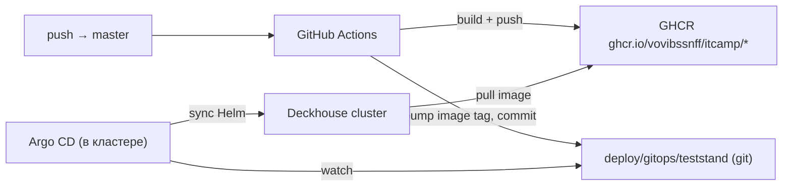

# Инфраструктура: тест-стенд КТК на VK Cloud

Отдельный план от [MVP](mvp_ктк_конструктор_f1ca3c09.plan.md) и от [локального стенда](infra_local_compose.plan.md). Здесь — **как поднять и как эксплуатировать** полноценный тест-стенд в облаке VK Cloud: где брать ПО, как обновлять, как управлять, как настроить автодоставку из этого репозитория, домен, белый IP и сертификаты.

**Целевой контур:** Terraform → Deckhouse Kubernetes Platform (EE) на VK Cloud → Istio + Angie → домен + TLS → Argo CD, который тянет образы/чарты из GHCR по коммитам в `master`.

**Требования, которым план подчинён (из SRD/MVP):** отечественный стек (Deckhouse, Picodata, Radix, Angie), микросервисы в namespaces `ktc-app/sim/ai/data/infra/obs`, node-pools `app/sim/ai(GPU)/db`, mTLS (Istio), HTTPS TLS 1.2+, единый вход только через gateway, GPU для `ai`.

---

## 0. TL;DR — слои и инструменты

| Слой | Чем управляем | Где живёт |
|---|---|---|
| Облако (сеть, ВМ, S3, LB, IP) | **Terraform** (провайдер `vk-cs/vkcs`) | `infra/terraform/` |
| Кластер K8s | **Deckhouse Platform EE** через `dhctl bootstrap` + `converge` | `infra/deckhouse/` (config.yml, ModuleConfig) |
| Платформенные модули | **Deckhouse ModuleConfig** (cert-manager, ingress, monitoring, …) | `infra/deckhouse/modules/` |
| Service mesh / edge | **Istio** (модуль DKP) + **Angie** (gw Deployment) | `deploy/` |
| Данные | **Picodata/Radix, MinIO, NATS** (Helm/операторы) | `deploy/data-layer/` |
| Приложения | **Helm-чарты** сервисов | `deploy/charts/`, `deploy/umbrella/` |
| Доставка (CD) | **Argo CD** (pull) + **GitHub Actions** (build/push) | `.github/workflows/`, `deploy/gitops/` |
| Реестр образов | **GHCR** `ghcr.io/vovibssnff/itcamp/*` (+ зеркало в отечественный registry для prod) | GitHub Packages |

**Принцип доставки:** GitHub Actions **никогда не ходит в кластер напрямую**. Actions собирает образы и пушит в GHCR + обновляет тег в GitOps-манифестах; Argo CD внутри кластера видит изменение и синхронизирует. Кластер за белым IP VK Cloud остаётся закрытым (только 443 наружу).

---

## 1. Что нужно достать (procurement / где брать ПО)

### 1.1 Критичное решение: Deckhouse на VK Cloud = **только Enterprise Edition**

Установка Deckhouse Kubernetes Platform на VK Cloud (OpenStack) поддерживается **только в EE** — CE/BE не умеют cloud-provider для VK Cloud. Учитывая «большие лимиты», берём EE.

| Что | Где брать | Заметка |
|---|---|---|
| **Лицензия Deckhouse EE** | Flant / `deckhouse.ru` (отдел продаж), trial-ключ для стенда | ключ = пароль к `registry.deckhouse.io` |
| **Инсталлятор `dhctl`** | контейнер `registry.deckhouse.io/deckhouse/ee/install:stable` | запускается локально в Docker |
| **Доступ к registry** | `docker login registry.deckhouse.io -u license-token -p <KEY>` | нужен HTTPS-доступ с машины установки |
| **Утилита `d8`** | `deckhouse.io/products/kubernetes-platform/documentation/.../d8/` | CLI управления DKP |

**Fallback, если EE недоступен:** VK Cloud **Managed Kubernetes (Cloud Containers)** + ручная установка Istio/cert-manager/мониторинга Helm-ами. Тогда «Deckhouse» из требований не выполняется — использовать только как временную меру, зафиксировать в рисках.

### 1.2 Остальной стек

| Компонент | Источник | Edition/лицензия |
|---|---|---|
| **VK Cloud** | `cloud.vk.ru` — проект, IAM, квоты | по договору; GPU-квота отдельно |
| **Terraform** | HashiCorp + провайдер `registry.terraform.io/providers/vk-cs/vkcs` | OSS |
| **Istio** | модуль DKP `istio` (встроен) | в составе EE |
| **Ingress** | модуль DKP `ingress-nginx` (edge) + **Istio Ingress Gateway** | в составе |
| **cert-manager** | модуль DKP `cert-manager` (ClusterIssuer `letsencrypt`) | в составе |
| **Мониторинг** | DKP `monitoring` (Prometheus-совместимый) → **Пульт/Графиня** как внешние datasource | Пульт/Графиня — ваш дистрибутив (chislitellab) |
| **Picodata CE** | `docker.binary.picodata.io/picodata:25.5.9` (публичный) | BSD core |
| **Radix** | `…/radix:<ver>` — **коммерческий плагин** Picodata (лицензия per-core) | иначе Redis как dev-замена |
| **MinIO** | `minio/minio` (или **VK Cloud S3** нативно) | на стенде можно нативный S3 VK Cloud |
| **NATS** | `nats:2.11-alpine` + JetStream | OSS |
| **Angie** | `docker.angie.software/angie:<ver>` | OSS |
| **Argo CD** | Helm `argo/argo-cd` или манифесты | OSS |
| **Реестр образов приложений** | **GHCR** `ghcr.io/vovibssnff/itcamp` | из этого репозитория |

### 1.3 Домен, белый IP, DNS

| Артефакт | Где | Заметка |
|---|---|---|
| **Домен** | регистратор РФ (RU-CENTER/Reg.ru) или существующий | напр. `ktc.example.ru` |
| **Белый (публичный) IP** | VK Cloud **Floating IP** → LoadBalancer Ingress | 1 IP на весь стенд достаточно |
| **DNS-зона** | VK Cloud DNS **или** ваш регистратор | нужны A/AAAA + (опц.) wildcard `*.ktc.example.ru` |
| **TLS** | Let's Encrypt через cert-manager (HTTP-01 или DNS-01) | DNS-01 нужен для wildcard |

### 1.4 Чеклист «готовы к bootstrap»

- [ ] VK Cloud проект + сервисный аккаунт (OpenStack creds: `OS_*`) с правами на compute/network/lbaas/s3
- [ ] Квоты подтверждены: vCPU, RAM, **GPU-flavor**, объём дисков, floating IP ≥2, LBaaS ≥1
- [ ] Лицензионный ключ Deckhouse EE, `docker login registry.deckhouse.io` работает
- [ ] Домен делегирован, есть доступ к DNS-зоне (для A-записи и DNS-01)
- [ ] GitHub: репозиторий, включён GHCR (Packages), заведены Actions secrets
- [ ] SSH-ключ для master-узла

---

## 2. Топология стенда (соответствие MVP §3)

```mermaid
flowchart TB
  user["Браузер (SPA)"] -->|HTTPS/WSS 443| fip["Floating IP (белый)"]
  fip --> lb["VK Cloud LoadBalancer"]
  lb --> istio["Istio Ingress Gateway (TLS)"]
  istio --> gw["Angie gw/BFF (JWT, RBAC, WS)"]
  subgraph dkp["Deckhouse K8s (VK Cloud)"]
    subgraph app["node-pool app"]
      gw --> auth & constructor & scenario & orchestrator & assessment & report & fe
    end
    subgraph sim["node-pool sim (CPU guaranteed, taint sim)"]
      orchestrator -->|gRPC| simw["sim-worker (per session)"]
    end
    subgraph ai["node-pool ai (GPU, taint ai)"]
      orchestrator -->|gRPC| aisvc["ai (vLLM/Ollama)"]
    end
    subgraph data["node-pool db → ns ktc-data"]
      pico[("Picodata Raft")]
      radix[("Radix/Redis")]
      minio[("S3 (MinIO / VK Cloud S3)")]
    end
    subgraph infra["ns ktc-infra"]
      nats[("NATS JetStream")]
    end
    subgraph obs["ns ktc-obs"]
      prom["DKP monitoring (Prometheus)"]
    end
  end
  prom -.->|datasource| grafinya["Пульт/Графиня (внешние)"]
```

**Node-groups (Terraform + DKP NodeGroup):**

| Группа | Назначение | Особенности |
|---|---|---|
| `master` | control-plane | 1 (стенд) или 3 (HA) |
| `app` | stateless-сервисы, gw, fe | HPA по CPU/mem |
| `sim` | sim-worker | guaranteed QoS, taint `sim=true` |
| `ai` | ai-инференс | GPU-flavor, taint `ai=true`, GPU Operator |
| `db` | Picodata/Radix/MinIO | SSD (high-iops), podAntiAffinity |

**Namespaces:** `ktc-app`, `ktc-sim`, `ktc-ai`, `ktc-data`, `ktc-infra`, `ktc-obs` (+ `argocd`, `d8-*` системные).

---

## 3. IaC: слой облака (Terraform, провайдер vkcs)

`infra/terraform/` — создаёт всё, что нужно ДО кластера, и remote state в S3 VK Cloud.

```
infra/terraform/
  providers.tf        # vkcs provider, backend "s3" (VK Cloud S3)
  variables.tf
  network.tf          # network, subnet, router, security groups
  floating_ip.tf      # белый IP под Ingress LB
  s3.tf               # бакеты: tfstate, snapshots, reports, component-icons
  images.tf           # data-source образа ОС (Ubuntu 22.04) для узлов DKP
  outputs.tf          # ids сети/подсети/IP → в config.yml Deckhouse
  env/
    teststand.tfvars
```

Провайдер и backend:

```hcl
terraform {
  required_providers {
    vkcs = { source = "vk-cs/vkcs" }
  }
  backend "s3" {
    endpoints = { s3 = "https://hb.vkcs.cloud" }
    bucket    = "ktc-tfstate"
    key       = "teststand/terraform.tfstate"
    region    = "ru-msk"
    skip_credentials_validation = true
    skip_region_validation      = true
    skip_requesting_account_id  = true
  }
}

provider "vkcs" {
  username   = var.vkcs_username
  password   = var.vkcs_password
  project_id = var.vkcs_project_id
  region     = "RegionOne"
  auth_url   = "https://infra.mail.ru:35357/v3/"
}
```

Сеть + белый IP (упрощённо):

```hcl
resource "vkcs_networking_network" "app" { name = "ktc-net" }
resource "vkcs_networking_subnet" "app" {
  name       = "ktc-subnet"
  network_id = vkcs_networking_network.app.id
  cidr       = "10.20.0.0/24"
}
resource "vkcs_networking_router" "app" {
  name                = "ktc-router"
  external_network_id = var.ext_network_id   # внешняя сеть VK Cloud
}
resource "vkcs_networking_router_interface" "app" {
  router_id = vkcs_networking_router.app.id
  subnet_id = vkcs_networking_subnet.app.id
}
resource "vkcs_networking_floatingip" "ingress" {
  pool = var.ext_network_name
}
```

> Примечание про кластер: сам K8s ставим **не** через `vkcs_kubernetes_cluster_v2` (это Managed K8s VK Cloud), а через **Deckhouse dhctl** (см. §4), потому что требование — именно Deckhouse. Terraform готовит сеть/подсеть/IP/S3, а Deckhouse получает их ID в `config.yml`. (Вариант «Managed K8s VK Cloud» — только для fallback из §1.1.)

Команды слоя:

```bash
cd infra/terraform
terraform init
terraform plan  -var-file=env/teststand.tfvars
terraform apply -var-file=env/teststand.tfvars
terraform output   # ids для Deckhouse config.yml
```

---

## 4. Кластер: Deckhouse Platform EE (VK Cloud / OpenStack)

`infra/deckhouse/` — конфиг bootstrap и модули.

### 4.1 Установка (bootstrap)

1. Логин в registry Deckhouse ключом EE:

```bash
docker login registry.deckhouse.io -u license-token -p <LICENSE_KEY>
```

2. `config.yml` — `OpenStackClusterConfiguration` под VK Cloud (сеть/подсеть/floating из Terraform outputs), release channel `Stable`, `masterNodeGroup`, cloud-provider creds (`OS_*`).

3. Запуск инсталлятора и bootstrap:

```bash
docker run -it --pull=always \
  -v "$PWD/config.yml:/config.yml" \
  -v "$PWD/dhctl-tmp:/tmp/dhctl" \
  -v "$HOME/.ssh/:/tmp/.ssh/" \
  registry.deckhouse.io/deckhouse/ee/install:stable bash

# внутри контейнера:
dhctl bootstrap \
  --ssh-user=ubuntu \
  --ssh-agent-private-keys=/tmp/.ssh/id_ed25519 \
  --config=/config.yml
```

4. Проверка: `d8 k get nodes`, `d8 k get pods -A`.

### 4.2 NodeGroups (app/sim/ai/db)

После bootstrap описываем `NodeGroup` (CRD DKP) со связкой к OpenStack-flavor'ам VK Cloud:

```yaml
apiVersion: deckhouse.io/v1
kind: NodeGroup
metadata:
  name: sim
spec:
  nodeType: CloudEphemeral
  cloudInstances:
    classReference: { kind: OpenStackInstanceClass, name: sim }
    minPerZone: 1
    maxPerZone: 4
  nodeTemplate:
    labels: { ktc.role: sim }
    taints:
      - key: sim
        value: "true"
        effect: NoSchedule
```

Аналогично `app`, `ai` (GPU-flavor + GPU Operator), `db` (high-iops диск, anti-affinity). `OpenStackInstanceClass` задаёт flavor/диск/зону.

### 4.3 Платформенные модули (ModuleConfig)

`infra/deckhouse/modules/*.yaml` — включаем и настраиваем:

| Модуль | Зачем |
|---|---|
| `cloud-provider-openstack` | интеграция с VK Cloud (LB, диски, floating) |
| `ingress-nginx` | edge Ingress (LoadBalancer → floating IP) |
| `istio` | mTLS mesh, Ingress Gateway для внутренних сервисов |
| `cert-manager` | ClusterIssuer `letsencrypt` (TLS) |
| `monitoring` / `prometheus` | метрики (datasource для Пульт/Графиня) |
| `user-authn` | доступ в кластер/дашборды по OIDC (опц.) |
| `node-manager` | автоскейл NodeGroups |
| `cni-cilium`/`calico` | сетевые политики |

Пример включения ingress с LB на floating IP:

```yaml
apiVersion: deckhouse.io/v1alpha1
kind: ModuleConfig
metadata:
  name: ingress-nginx
spec:
  enabled: true
  version: 1
  settings:
    inlet: LoadBalancer
    loadBalancer:
      annotations:
        # привязка к заранее выделенному floating IP VK Cloud
        loadbalancer.openstack.org/floating-ip: "<FLOATING_IP_FROM_TF>"
```

### 4.4 Обновление кластера

- **Версия платформы:** переключение release channel в `deckhouse` ModuleConfig (`Alpha→Beta→EarlyAccess→Stable→RockSolid`); DKP катит апдейт сам с окнами обновлений.
- **Конфиг/узлы:** правим `config.yml`/`NodeGroup` → `dhctl converge` (или через Git, если подключён `deckhouse` GitOps).
- **K8s версия:** параметр `kubernetesVersion` в global ModuleConfig; DKP делает rolling-upgrade control-plane и узлов.

---

## 5. Edge: домен, белый IP, TLS, gateway

### 5.1 DNS

- A-запись `ktc.example.ru` → **floating IP** (из Terraform / привязан к Ingress LB).
- Для wildcard (`*.ktc.example.ru`, напр. `api.`, `s3.`, `grafana.`) — либо отдельные A-записи, либо wildcard + **DNS-01**.

### 5.2 TLS через cert-manager

ClusterIssuer `letsencrypt` доступен из коробки (модуль cert-manager). Для сервиса:

```yaml
apiVersion: networking.k8s.io/v1
kind: Ingress
metadata:
  name: ktc-gw
  namespace: ktc-app
  annotations:
    cert-manager.io/cluster-issuer: letsencrypt   # HTTP-01
spec:
  ingressClassName: nginx
  tls:
    - hosts: [ktc.example.ru, api.ktc.example.ru]
      secretName: ktc-tls
  rules:
    - host: ktc.example.ru
      http:
        paths:
          - path: /
            pathType: Prefix
            backend: { service: { name: gw, port: { number: 80 } } }
```

- **HTTP-01** — проще, работает для конкретных хостов.
- **DNS-01** — нужен для wildcard; настраивается ClusterIssuer с webhook под провайдера DNS (VK Cloud DNS / внешний). См. cert-manager docs.

### 5.3 Gateway (Angie) и WS/gRPC

- Внешний вход: Istio Ingress Gateway (TLS) → **Angie** (JWT verify, RBAC, rate-limit-задел, WS-проксирование, агрегация, статика SPA) → апстримы (см. MVP §8.1).
- WebSocket (`/api/v1/ws/...`) и gRPC-passthrough — по MVP; Angie проксирует WS, Istio даёт mTLS внутрь.
- «Белый API»: наружу открыт только 443 на floating IP; всё остальное — ClusterIP + NetworkPolicy.

---

## 6. Данные (ns ktc-data / ktc-infra)

| Компонент | Как в стенде | Заметка |
|---|---|---|
| **Picodata** | StatefulSet (Helm), Raft, `replication_factor` ≥2, podAntiAffinity, PVC high-iops | PG-wire :4327; failover <30 c |
| **Radix** | если есть лицензия — плагин Picodata; иначе Redis StatefulSet под DNS `radix:7379` | тот же `RADIX_URL` |
| **S3** | **VK Cloud S3** нативно (проще) **или** MinIO StatefulSet | бакеты `snapshots/reports/component-icons` |
| **NATS** | StatefulSet JetStream (стенд: 1–3 узла), PV | стримы `REPORT_TASKS/AI_TASKS/SESSION_EVENTS/ASSESSMENT_EVENTS` |

Чарты кладём в `deploy/data-layer/` (переиспользуем идеи из локального `infra/local`). Init-job'ы (buckets/streams/SQL) — как в локальном стенде, но как Helm hooks / Argo CD PreSync.

---

## 7. Автодоставка из репозитория (CI/CD)

### 7.1 Модель

**Pull-based GitOps:** GitHub Actions делает CI (build/test/push в GHCR) и обновляет тег образа в GitOps-манифестах в этом же репозитории; **Argo CD** в кластере отслеживает `master` (путь `deploy/gitops/teststand`) и синхронизирует. Кластер не открывает API наружу для CI.



### 7.2 GitHub Actions: build & push (пример)

`.github/workflows/build.yml`:

```yaml
name: build-and-push
on:
  push:
    branches: [master]
permissions:
  contents: write        # для commit bump в gitops
  packages: write        # push в GHCR
jobs:
  build:
    runs-on: ubuntu-latest
    strategy:
      matrix:
        service: [auth, constructor, scenario, orchestrator, assessment, snapshot, report, sim, ai, gw, fe]
    steps:
      - uses: actions/checkout@v4
      - uses: docker/login-action@v3
        with:
          registry: ghcr.io
          username: ${{ github.actor }}
          password: ${{ secrets.GITHUB_TOKEN }}
      - uses: docker/build-push-action@v6
        with:
          context: services/${{ matrix.service }}
          push: true
          tags: |
            ghcr.io/vovibssnff/itcamp/${{ matrix.service }}:${{ github.sha }}
            ghcr.io/vovibssnff/itcamp/${{ matrix.service }}:latest
```

### 7.3 Bump тега в GitOps (пример, отдельный job)

```yaml
  bump:
    needs: build
    runs-on: ubuntu-latest
    steps:
      - uses: actions/checkout@v4
      - name: set image tags
        run: |
          SHA=${GITHUB_SHA::7}
          for s in auth constructor scenario orchestrator assessment snapshot report sim ai gw fe; do
            yq -i ".images.${s}.tag = \"${GITHUB_SHA}\"" deploy/gitops/teststand/values.yaml
          done
      - name: commit
        run: |
          git config user.name  github-actions
          git config user.email actions@github.com
          git commit -am "deploy(teststand): ${GITHUB_SHA::7} [skip ci]" || echo "no changes"
          git push
```

> Альтернатива без commit-петли: **Argo CD Image Updater** — следит за GHCR и сам обновляет теги в Application/values. Выбрать один из двух путей (commit-bump проще и полностью прозрачен в истории).

### 7.4 Argo CD Application (в кластере)

`deploy/gitops/teststand/application.yaml`:

```yaml
apiVersion: argoproj.io/v1alpha1
kind: Application
metadata:
  name: ktc-teststand
  namespace: argocd
spec:
  project: default
  source:
    repoURL: https://github.com/vovibssnff/itcamp.git
    targetRevision: master
    path: deploy/umbrella          # umbrella Helm-чарт
    helm:
      valueFiles: [../gitops/teststand/values.yaml]
  destination:
    server: https://kubernetes.default.svc
    namespace: ktc-app
  syncPolicy:
    automated: { prune: true, selfHeal: true }
    syncOptions: [CreateNamespace=true]
```

### 7.5 Доступ к приватным образам GHCR

- Публичный репозиторий → образы можно сделать public (проще всего для стенда).
- Приватные → `imagePullSecret` в namespaces с classic PAT (`read:packages`); Argo CD repo-creds — тоже PAT.

---

## 8. Секреты

| Секрет | Где хранить | Заметка |
|---|---|---|
| VK Cloud `OS_*` / vkcs creds | GitHub Actions secrets + локально (не в git) | для Terraform/dhctl |
| Deckhouse EE license | вне git, в `docker login` | не коммитить |
| JWT ключи (auth) | K8s Secret (генерятся при деплое) | RS256 пара |
| Picodata/MinIO/NATS creds | K8s Secret + **sealed-secrets** или **Vault** | в git только запечатанные |
| GHCR PAT | K8s `imagePullSecret`, Argo CD repo secret | scope `read:packages` |

Рекомендация для стенда: **sealed-secrets** (модуль/Helm) — можно хранить зашифрованные секреты в git и катить через Argo CD. Vault — если нужен полноценный KV/PKI (MVP §21 откладывает часть ИБ).

---

## 9. Наблюдаемость

- DKP-модуль `monitoring` (Prometheus-совместимый) собирает `/metrics` со всех сервисов.
- **Пульт/Графиня** подключаются как внешние: Графиня ← datasource Prometheus (DKP), Пульт ← инфра-метрики/алерты. (Детали — как в вашем дистрибутиве; на стенде можно отложить, метрики уже собираются DKP.)
- Ключевые метрики (MVP §19): tick-lag, активные сессии, WS-соединения, save/restore, GPU util/VRAM, Raft Picodata, стримы NATS, HTTP-коды gw.

---

## 10. Day-2: как эксплуатировать и обновлять

### 10.1 Обновления

| Что меняем | Как |
|---|---|
| Облачные ресурсы (сеть/IP/S3/квоты) | правка `*.tf` → `terraform plan/apply` |
| Топология кластера (узлы/flavor) | `NodeGroup`/`OpenStackInstanceClass` → `dhctl converge` или git |
| Версия Deckhouse | release channel в `deckhouse` ModuleConfig (авто-катит) |
| Версия K8s | `kubernetesVersion` (rolling upgrade) |
| Платформенные модули | `ModuleConfig` через git/Argo CD |
| Приложения | push в `master` → CI → GHCR → Argo CD sync |
| Data-layer (Picodata/NATS) | bump версии чарта в GitOps values |

### 10.2 Масштабирование

- App: HPA (CPU/mem) + `maxPerZone` в NodeGroup.
- Sim: рост числа сессий → `sim` NodeGroup `maxPerZone` вверх (1 pod/session, MVP §10).
- AI: GPU NodeGroup + GPU Operator (MPS/MIG для дробления GPU, VK Cloud how-to).

### 10.3 Бэкапы / восстановление

- **tfstate** — в S3 (versioning вкл.).
- **Picodata** — снапшоты Raft/дамп в S3 по расписанию (CronJob).
- **S3-бакеты** (snapshots/reports) — versioning + жизненный цикл.
- **etcd/DKP** — штатные механизмы Deckhouse (backup control-plane).
- Проверка восстановления — часть runbook (kill Picodata primary → failover <30 c, MVP §21 TEST-07).

### 10.4 Откаты

- Приложения: Argo CD `rollback` на предыдущий синхронизированный commit; или revert git-коммита тега.
- Инфра: `terraform apply` на предыдущий стейт/тег; DKP — откат release channel не делаем, только вперёд.

---

## 11. Порядок работ (фазы)

### I0 — Подготовка (procurement)
Закрыть чеклист §1.4: VK Cloud проект+квоты+GPU, лицензия DKP EE, домен+DNS, GHCR/Actions secrets, SSH-ключ.

### I1 — Terraform (облако)
Сеть/подсеть/роутер/floating IP/S3/security groups, remote state. Выход: `terraform output` c ID для DKP.

### I2 — Deckhouse bootstrap
`config.yml` (OpenStack VK Cloud) → `dhctl bootstrap` → master онлайн. Выход: `d8 k get nodes` зелёный.

### I3 — NodeGroups + модули
`app/sim/ai/db`, `OpenStackInstanceClass`, GPU Operator; ModuleConfig (ingress, istio, cert-manager, monitoring, cloud-provider). Выход: узлы всех ролей + Ingress LB на floating IP.

### I4 — Домен + TLS + gateway
A-запись → floating IP; ClusterIssuer letsencrypt; Ingress + Angie gw; проверка `https://ktc.example.ru/healthz`.

### I5 — Данные
Picodata (Raft) + Radix/Redis, S3 (VK Cloud/MinIO), NATS JetStream + init (buckets/streams/SQL). Выход: data-plane зелёный.

### I6 — CD (Argo CD + Actions)
Установить Argo CD; Application на `master`/`deploy/umbrella`; workflow build→GHCR→bump. Выход: push в master → авто-деплой на стенд.

### I7 — Приложения
Umbrella-чарт сервисов из MVP (auth…fe), seed демо-контента; smoke E2E (логин → сессия → телеметрия).

### I8 — Day-2 runbook
Задокументировать §10; настроить бэкапы, окна обновлений, алерты.

---

## 12. Структура репозитория (создать)

```
infra/
  terraform/            # облако VK Cloud (vkcs)
  deckhouse/
    config.yml          # bootstrap (OpenStack VK Cloud) — без секретов, секреты через env
    modules/*.yaml      # ModuleConfig
    nodegroups/*.yaml   # NodeGroup + OpenStackInstanceClass
  ansible/              # (опц.) пост-настройка узлов
deploy/
  charts/<service>/     # Helm на сервис
  data-layer/           # Picodata/Radix/MinIO/NATS
  umbrella/             # зонтичный чарт стенда
  gitops/teststand/     # values.yaml (теги образов) + application.yaml (Argo CD)
.github/workflows/
  build.yml             # build+push+bump
```

---

## 13. Критерии приёмки стенда

1. `terraform apply` создаёт сеть/IP/S3 идемпотентно; state в S3.
2. `dhctl bootstrap` поднимает DKP EE; `d8 k get nodes` показывает `app/sim/ai/db`.
3. `https://ktc.example.ru` открывается с валидным Let's Encrypt сертификатом (TLS 1.2+).
4. Наружу открыт только 443 на floating IP; внутренние сервисы — ClusterIP + NetworkPolicy.
5. Push в `master` → образ в GHCR → Argo CD синхронизировал → сервис обновился (traceable по git).
6. Data-plane: Picodata `SELECT 1`, Redis/Radix `PONG`, S3 buckets, NATS streams.
7. GPU-узел виден (`nvidia.com/gpu`), `ai` под планируется на нём.
8. Runbook §10 воспроизводим: обновление, масштабирование, бэкап/восстановление, откат.

---

## 14. Риски и митигации

| Риск | Митигация |
|---|---|
| DKP на VK Cloud = только EE (нет CE) | взять EE (лимиты позволяют); fallback — Managed K8s VK Cloud + ручной Istio/cert-manager (с пометкой «не Deckhouse») |
| Нет GPU-квоты VK Cloud | запросить заранее; временно `ai` в CPU-режиме (rule-based), GPU позже |
| Radix коммерческий | Redis как dev-замена под тем же `RADIX_URL`; для «отечественного контура» — лицензия Radix |
| Wildcard TLS требует DNS-01 | либо перечислять хосты (HTTP-01), либо настроить DNS-01 webhook |
| CI commit-петля (bump) | `[skip ci]` в bump-коммите **или** Argo CD Image Updater |
| Секреты в git | sealed-secrets/Vault; в git только зашифрованное |
| Дрейф между local и teststand | единые имена сервисов/env (`PICODATA_DSN`,`RADIX_URL`,`S3_ENDPOINT`,`NATS_URL`) из local-плана → values-teststand |
| ФСТЭК/ИБ (KUMA, Vault, ГОСТ-TLS) | на стенде отложено (MVP §21/§22); заложены точки расширения |

---

## 15. Связь с другими планами

| План | Роль |
|---|---|
| [MVP](mvp_ктк_конструктор_f1ca3c09.plan.md) | что деплоим (сервисы, namespaces, node-pools, API) |
| [Локальный стенд](infra_local_compose.plan.md) | dev-контур; те же образы/имена/env переносятся в `deploy/` |
| Этот план | облако + кластер + edge + автодоставка + эксплуатация |

**Инварианты между контурами:** DNS-имена и env (`PICODATA_DSN`, `RADIX_URL`, `S3_ENDPOINT`, `NATS_URL`) одинаковы локально и на стенде — код и чарты не переписываются, меняются только values.
