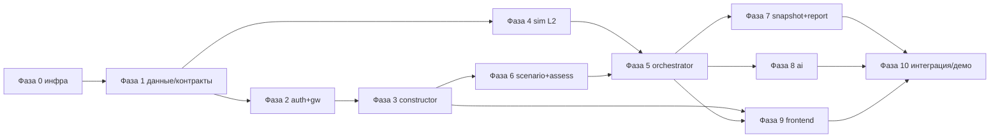

# План реализации MVP «Конструктор КТК»

Документ самодостаточен: релевантные требования SRD и решения архитектуры вписаны прямо в текст (без внешних ссылок). API каждого сервиса сконструированы детально в разделах §6–§17.

**Что строим (scope, подтверждён):** конфигурируемая платформа-тренажёр. Инструктор визуально собирает установку из библиотеки компонентов (drag-and-drop, ручные связи), создаёт сценарии, запускает сессии и наблюдает за операторами в режиме read-only. Оператор проходит тренировку/экзамен на HMI. Неисправности вносятся только автоматически из сценария. Развёртывание: полный Deckhouse + Istio на VKCloud, 12 сервисов раздельно, физика L2 (упрощённые ODE), реальный LLM на GPU (Explain) + rule-based/ML (Predict/Adaptive/Generate).

**ИБ частично отложена** (см. §21): оставляем «бесплатные» механизмы (Istio mTLS, JWT+RBAC, server-authoritative, SHA-256 снапшота); откладываем HMAC-протокол, KUMA-аудит, Vault, rate-limit, парольные политики, XSS/CSRF/SQLi-hardening, пентест.

---

## 1. Целевой стек и конвенции

**Технологический стек (из SRD §7.3, отечественный контур):**
- Оркестрация — **Deckhouse** (российский дистрибутив Kubernetes).
- Service Mesh — **Istio** (mTLS между сервисами, Ingress Gateway, traffic policies, AuthorizationPolicy).
- API Gateway / BFF — **Angie** (отечественный форк nginx; JWT, RBAC, rate-limit-задел, агрегация, WS-проксирование) за Istio Ingress.
- Внешний API — **REST** (OpenAPI 3.1) + **WebSocket** (телеметрия 1 Гц). Внутренний — **HTTPS/REST + mTLS** для CRUD-сервисов; **gRPC** для `sim` (Model API), `snapshot` и `ai` (AI API); события — **NATS JetStream**.
- Frontend — React 18 + TypeScript + Vite; **Konva** (canvas конструктора и мнемосхемы); **uPlot** (тренды 4–8 серий); Ant Design; Zustand; нативный WS-клиент с авто-reconnect; i18next (ru/en). Клиент — Chromium-based, в т.ч. Яндекс.Браузер (`NFR-COMP-01`).
- Backend — **Go 1.22** для всех сервисов, кроме фронтенда (`ui`/`frontend` — React SPA). REST (net/http + chi/gin), gRPC (google.golang.org/grpc). У всех сервисов служебные `/healthz`, `/readyz`, `/metrics` (Prometheus-формат для Пульт).
- СУБД — **Picodata** (PG-wire, Raft-репликация, ФСТЭК УД4, РРПО). Кэш — **Radix** (Redis-совместимый плагин Picodata). Объектное хранилище — **MinIO** (S3, MVP-заглушка отечественного решения). Очередь — **NATS JetStream**. SIEM — **KUMA** (в MVP отложено).
- Мониторинг — **Пульт** (Prometheus-совместимый) + **Графиня** (дашборды); логи — Fluent Bit → Пульт.

**Архитектурные принципы (SRD §7.8), которым подчинён план:**
- `ARCH-01` Модульность: замена Simulation Engine (L2→L3) без переписывания HMI/ИИ — через стабильный Model API.
- `ARCH-02` Server-authoritative state: клиент не считает «истину» телеметрии/оценки.
- `ARCH-03` Изоляция OT: нет OPC/OPC UA/Modbus, нет маршрутов/egress в OT-сеть, все теги порождает только `sim` (`FR-ISO-01/02/03`).
- `ARCH-04` gRPC внутри hot-path, REST наружу.
- `ARCH-07` Граф — единица конфигурации: топология установки определяет модель, HMI, сценарии.
- `ARCH-08` Per-session isolation: каждая сессия — изолированный экземпляр Simulation Engine.

**Инженерные конвенции проекта:**
- Сериализация графа/состояния — канонический JSON по `schemas/`; `schema_version` включён в граф и снапшот.
- Picodata-нюанс (SRD §7.4): системные каталоги PG реализованы частично → **raw SQL (pgx) без reflection**, миграции — SQL-скрипты.

## 2. Монорепо (структура)

```
itcamp/
  infra/            # Terraform (VKCloud) + Ansible + Deckhouse ModuleConfig + Istio манифесты
  deploy/           # Helm-chart на каждый сервис + umbrella chart + values-{dev,prod}
  proto/            # model_api.proto (ktk.sim.v1), snapshot_api.proto (ktk.snap.v1), ai_api.proto (ktk.ai.v1)
  schemas/          # component_type / template_graph / scenario / sim_state / error / page  (JSON Schema)
  db/migrations/    # централизованные SQL-миграции Picodata (диапазоны: 0001-0099 auth, 0100-0199 constructor, ...)
  tools/migrator/   # единый мигратор (golang-migrate, apply/down/version/force/create)
  services/
    auth/           # ✅ готово (Go 1.22, LDAP+JWT+MFA+introspect)
    gw/             # Angie conf + Go BFF middleware
    constructor/ scenario/ orchestrator/ assessment/ snapshot/ report/   # Go 1.22
    sim/            # sim-manager (K8s API) + sim-worker (gRPC Model API) + models/
    ai/             # gRPC AI API server + inference adapters (vLLM/Ollama) + rule-based
  frontend/         # React SPA (screens/, canvas/, ws/, store/, i18n/)
  seeds/            # библиотека КТС (24 типа) + demo-template + ≥5 сценариев + ≥3 пресета
```
Каждый Go-сервис строится по образцу `services/auth`: `cmd/<svc>/main.go`, `internal/{config,domain,repository,security,service,transport,server}`, `api/openapi.yaml`, `deploy/`, `go.mod` (Go 1.22). Миграции — централизованно в `db/migrations/` (префикс `NNNN_<service>_*`), применяется через `tools/migrator`. Контейнеризация и monorepo покрывают `NFR-SCL-04`.

## 3. Namespaces, node pools, потоки

```mermaid
flowchart TB
  user["Browser SPA"] -->|HTTPS/WSS| ingress["Istio Ingress Gateway (443, TLS)"]
  ingress --> gw["Angie gw/BFF (JWT+RBAC, WS-proxy, static)"]
  gw --> auth
  gw --> constructor
  gw --> scenario
  gw --> orchestrator
  gw --> assessment
  gw --> report
  orchestrator -->|gRPC Model API| sim["sim-worker (per session)"]
  orchestrator -->|gRPC AI API| ai["ai (GPU)"]
  orchestrator -->|gRPC Snapshot API| snapshot
  orchestrator -->|NATS| broker[("NATS JetStream")]
  broker --> report
  broker --> ai
  orchestrator --> assessment
  scenario --> constructor
  assessment --> ai
  subgraph data ["ktc-data"]
    picodata[("Picodata")]
    radix[("Radix")]
    minio[("MinIO S3")]
  end
  auth --> picodata
  auth --> radix
  constructor --> picodata
  constructor --> minio
  scenario --> picodata
  orchestrator --> picodata
  orchestrator --> radix
  snapshot --> minio
  snapshot --> picodata
  report --> minio
  report --> picodata
  assessment --> picodata
```

- **Namespaces:** `ktc-app` (gw, auth, constructor, scenario, orchestrator, assessment, snapshot, report, fe), `ktc-sim` (sim-manager + sim-worker), `ktc-ai` (ai, GPU), `ktc-data` (Picodata, Radix, MinIO), `ktc-infra` (NATS), `ktc-obs` (Пульт, Графиня, Fluent Bit).
- **Node pools:** `app` (HPA по CPU/memory), `sim` (CPU guaranteed QoS для 1 Гц, taint `sim=true`), `ai` (GPU, nodeSelector+taint `ai=true`), `db` (SSD, anti-affinity across hypervisors).
- **Сетевые политики:** NetworkPolicy — межсервисный трафик только по разрешённым портам; Ingress наружу — только Angie (443); egress в OT-сеть запрещён.

## 4. Модель данных (Фаза 1)

Сущности из SRD §6.1, адаптированные под мердж (убрано версионирование шаблонов и `TemplateVersion`; `FaultInjection` перешёл в авто-событие из сценария). Все таблицы — в Picodata; payload-и — в MinIO.

- **`users`** — id, login, full_name, ldap_dn, status (`active|locked|disabled`), mfa_enabled, created_at, updated_at. Паролей не хранит — аутентификация через LDAP/AD (FR-AUTH-01/02 v2.1).
- **`component_types`** — id, name, category (`Общие|ЭЛОУ|Атмосфера|ГДМ`), description, ports (JSONB), parameters (JSONB), model_code (ключ ODE-класса в `sim`), icon_s3_key, documentation.
- **`installation_templates`** — id, name, description, author_id, status (`draft|published|archived`), graph (JSONB), layout (JSONB), created_at, updated_at.
- **`scenarios`** — id, template_id, name, description, type (`training|exam`), start_preset_id, faults (JSONB), reference_actions (JSONB), criteria (JSONB), author_id, created_at.
- **`faults_catalog`** — fault_id, name, applicable_component_types[] , description, affected_tags[], severity, damage_per_sec.
- **`sessions`** — id, scenario_id, template_id, instructor_id, operator_ids[], mode (`training|exam`), speed, status (`created|running|paused|stopped|finished`), model_time, started_at, stopped_at.
- **`operator_actions`** (append-only) — id, session_id, user_id, type, target (tag), action, value, model_time, server_time.
- **`alarm_events`** — id, session_id, component_instance_id, tag_id, priority (`HH|H|L|LL`), raised_model_time, ack_model_time, ack_user_id.
- **`fault_events`** (append-only) — id, session_id, fault_id, component_instance_id, params (JSONB), trigger, fired_model_time (журнал сработавших неисправностей, `FR-FLT-04`).
- **`snapshots`** — id, session_id, name, model_time, author_id, schema_version, sha256, storage_key, is_preset, created_at.
- **`assessments`** — id, session_id, penalties (JSONB), critical_errors (JSONB), reaction_times (JSONB), total_score, verdict (`pass|fail|pending`), override_by, override_comment.
- **`reports`** — id, session_id, type (`session|exam`), status (`queued|processing|ready|failed`), canonical_json, storage_key, created_at.
- **`ai_insights`** — id, session_id, type (`explain|predict_physics|predict_behaviour|analyze`), input (JSONB), output (JSONB), model_time.

**Граф установки (`schemas/template.graph.json`)** — из SRD §6.2, дословно формат:
```json
{
  "schema_version": "2.0",
  "nodes": [
    {
      "id": "pump-n2-001",
      "component_type_id": "centrifugal_pump",
      "label": "Н-2",
      "position": { "x": 120, "y": 340 },
      "parameters": { "Q_nom": 560, "P_max": 22, "N_kw": 400 },
      "ports": {
        "inlet":  { "type": "liquid", "connected_to": "pipe-003" },
        "outlet": { "type": "liquid", "connected_to": "pipe-004" }
      }
    }
  ],
  "edges": [
    {
      "id": "pipe-003",
      "type": "liquid",
      "from": { "node_id": "column-k1", "port": "bottom_outlet" },
      "to":   { "node_id": "pump-n2-001", "port": "inlet" }
    }
  ],
  "layout": { "mnemo_positions": {}, "custom_labels": {} }
}
```

**Init-state для sim (`schemas/sim_state.json`)** — результат `constructor.export`, он же формат снапшота (`FR-SNAP-01`):
```json
{
  "schema_version": "2.0",
  "model_time": 0.0,
  "seed": 20260806,
  "nodes": [
    { "instance_id": "pump-n2-001", "model_code": "centrifugal_pump",
      "parameters": { "Q_nom": 560, "P_max": 22 },
      "state": { "running": true, "Q": 0.0, "P_out": 0.0 } }
  ],
  "connections": [ { "id": "pipe-003", "type": "liquid", "from": "column-k1:bottom_outlet", "to": "pump-n2-001:inlet" } ],
  "regulators": [ { "tag_id": "FRC-458", "pv": 0, "sp": 300, "out": 0, "mode": "AUTO", "Kp": 1.2, "Ki": 0.05, "Kd": 0 } ],
  "alarms": [],
  "tags": [ { "tag_id": "PRSA-204", "value": 1.2, "unit": "кгс/см2" } ]
}
```

## 5. Общие API-конвенции (для всех REST-сервисов)

- **Внешняя база:** `https://<host>/api/v1`. Внутри mesh сервисы слушают свой ClusterIP; `gw` префиксует пути на апстримы.
- **Trust boundary (auth.md §6):** `gw` — единственная точка проверки JWT (через `auth /introspect`). Проверенный контекст передаётся downstream заголовками `X-User-ID` / `X-Roles`. Внутренние сервисы токен не валидируют и ключ подписи не знают. Сервисы обязаны стирать входящие `X-User-ID`/`X-Roles` от клиента.
- **RBAC:** проверяется в `gw` на маршруте. Внутренние сервисы доверяют заголовкам от `gw` (mTLS + NetworkPolicy). Ответ при нехватке прав — `403`.
- **Ошибки — RFC 7807 (`application/problem+json`)**, схема `schemas/error.json`.
- **Пагинация:** `?limit=50&offset=0`; ответ-конверт `schemas/page.json`.
- **Идемпотентность/трассировка:** сквозной `X-Request-Id` (генерит `gw`, пробрасывается в NATS-события и логи).
- **Время:** ISO-8601 UTC для серверного времени; `model_time` — секунды (float) модельного времени.
- **Версионирование:** REST — префикс `/api/v1`; gRPC — пакеты `ktk.sim.v1`, `ktk.snap.v1`, `ktk.ai.v1`.
- **Контракты (артефакты, не инлайн):**
  - OpenAPI 3.1: `services/<svc>/api/openapi.yaml` (auth, gw, constructor, scenario, orchestrator, assessment, snapshot, report)
  - gRPC proto: `proto/model_api.proto` (sim), `proto/snapshot_api.proto`, `proto/ai_api.proto`
  - JSON Schemas: `schemas/{error,page,component_type,template_graph,scenario,sim_state}.json`
  - WS/NATS — AsyncAPI 2.6 (описаны в `services/orchestrator/api/openapi.yaml` в комментариях)

## 6. Фаза 0 — Инфраструктура и фундамент

- **Terraform (VKCloud):** VPC/подсети, ВМ Deckhouse (3 master + N worker), node-pools `app`/`sim`/`ai`(GPU)/`db`, object storage (S3) или ВМ под MinIO, DNS/сертификаты для Ingress.
- **Ansible + Deckhouse:** базовая настройка узлов; Deckhouse ModuleConfig; включение Istio (Ingress Gateway, sidecar-injection на `ktc-app`/`ktc-sim`/`ktc-ai`).
- **Data layer:** Picodata (StatefulSet, Raft, anti-affinity; failover <30 с — `NFR-REL-01`), Radix, NATS JetStream (StatefulSet N≥3, PV), MinIO (buckets `snapshots`/`reports`/`component-icons`).
- **`pkg/` (Go 1.22):** env-config, JSON-логи, JWT-verify middleware (публичный ключ от `auth`), Picodata-клиент (raw SQL, пул), NATS pub/sub, health/metrics, RFC7807-хелпер.
- **CI/CD:** сборка/push образов в registry, линт+юнит-тесты, spectral(OpenAPI)+buf(proto), Helm-деплой; umbrella chart в `deploy/`.
- **Выход фазы:** пустой кластер со всеми зависимостями, общий пакет, сгенерированные gRPC-стабы, применённые SQL-миграции и JSON-схемы.

---

## 7. Сервис `auth` — аутентификация и RBAC

**Назначение (архитектура):** идентификация и управление доступом. Аутентификация через **LDAP/AD** (FR-AUTH-01/02 v2.1). После успешной проверки выдаются JWT. 2FA (TOTP) для привилегированных ролей. Эмиссия и проверка JWT. Чувствителен к правам — изолированный сегмент, отдельное масштабирование.

**Реализация:** Go 1.22 (готово, `services/auth/`); LDAP bind через `go-ldap/ldap/v3`; JWT HS256 (access TTL 15 мин, refresh TTL 24 ч, ротация refresh при использовании); RBAC 3 роли; 2FA TOTP (`pquerna/otp`, секреты шифруются AES-256-GCM); lockout после 5 неудачных попыток (FR-AUTH-05); аудит входов в лог (KUMA отложена). Локальных паролей **нет** — пароли хранит LDAP.

**Trust boundary (auth.md §6):** `gw` — единственная точка проверки JWT. При запросе `gw` вызывает `auth /introspect`, проверяет токен (подпись, срок, отзыв) и получает роли. Проверенный контекст `gw` передаёт downstream заголовками `X-User-ID` / `X-Roles`. **Внутренние сервисы токен не проверяют и ключ подписи не знают.** Запрос от `gw` считается авторизованным — доверие через mTLS + NetworkPolicy «accept only from gw». Сервисы обязаны стирать входящие `X-User-ID`/`X-Roles` от клиента.

**Контракт:** `services/auth/api/openapi.yaml` (OpenAPI 3.1, актуализирован под LDAP+MFA+trust boundary).

### 7.1 REST API `auth` (OpenAPI `services/auth/api/openapi.yaml`)

| Метод и путь | Роль | Назначение |
|---|---|---|
| `POST /login` | public | вход по логину/паролю через LDAP → JWT (+ mfa_code если MFA) |
| `POST /refresh` | public (по refresh) | ротация токенов |
| `POST /logout` | any | отзыв refresh |
| `GET /me` | any | профиль текущего пользователя |
| `POST /introspect` | internal (mesh) | валидация JWT для gw (trust boundary) |
| `GET /users` | admin | список пользователей (read-only; учётки ведутся в LDAP/AD) |
| `GET /users/{id}` | admin | карточка пользователя (read-only) |
| `POST /users/{id}/mfa/setup` | any auth | генерация TOTP-секрета |
| `POST /users/{id}/mfa/enable` | any auth | включение MFA (проверка кода) |
| `GET /users/{id}/mfa` | any auth | статус MFA |

**`POST /login`** — запрос `{ "login": "ivanov", "password": "...", "mfa_code": "123456" }`; ответ `200`:
```json
{ "access_token": "eyJ...", "refresh_token": "eyJ...", "token_type": "Bearer",
  "expires_in": 900 }
```
Если MFA требуется — `200 { "mfa_required": true }`. `401` — неверные креды; `429` — lockout; `503` — LDAP недоступен.

**`POST /introspect`** (сервис-сервис) — `{ "token": "eyJ..." }` → `{ "active": true, "user_id": "u-1", "login": "ivanov", "roles": ["instructor"], "token_id": "..." }`. Если токен недействителен — `{ "active": false }`.

### 7.2 Данные / K8s
- Picodata `users` (без password_hash — пароли в LDAP), `roles`, `user_roles`, `refresh_tokens`, `login_attempts`, `mfa_secrets`. Миграции — `db/migrations/0001-0006_auth_*.sql`.
- Deployment N≥2, HPA; Service ClusterIP; Secret (ключ подписи JWT); NetworkPolicy (accept только от `gw`; egress к Picodata, LDAP через Egress Gateway, PAM); istio-sidecar (mTLS).

### 7.3 Покрывает (инлайн требований SRD v2.1)
- `FR-AUTH-01` Аутентификация через LDAP/AD → JWT (access + refresh) — **Must**.
- `FR-AUTH-02` Без LDAP вход запрещён; локальных паролей нет — **Must**.
- `FR-AUTH-03` RBAC с 3 ролями: Админ, Инструктор, Оператор — **Must**.
- `FR-AUTH-04` Разграничение доступа к API и экранам по ролям — **Must**.
- `FR-AUTH-05` Парольная политика (≥8, сложность), блокировка после 5 неудачных — **Must**.
- `FR-AUTH-06` Access TTL 15 мин, refresh TTL 24 ч, ротация refresh — **Must**.
- `FR-ROLE-01` Реализованы 3 роли — **Must**; `FR-ROLE-02` Админ просматривает пользователей read-only, учётки/роли ведутся во внешнем LDAP/AD (CRUD вне платформы) — **Must**; `FR-ROLE-05` Админ управляет тренажёрным комплексом (контент, политика оценки, учебный аудит), **не** инфраструктурой — **Must**.
- Частично `NFR-SEC-01` (HTTPS TLS 1.2+, JWT, RBAC на каждом запросе).
- **2FA (TOTP)** для привилегированных ролей (admin, instructor) — auth.md §2.

## 8. Сервис `gw` — API Gateway / BFF (Angie)

**Назначение (архитектура):** прикладной контрактный слой между клиентом и внутренними сервисами. Istio Ingress Gateway делает сетевой вход (TLS-терминация, маршрутизация по host/path, mTLS внутрь). Angie/BFF делает прикладную логику: проверку JWT через `auth /introspect` (trust boundary — см. §7), RBAC по ролям, агрегацию, версии, задел под rate-limit, WS-проксирование, раздачу статики SPA, хостинг `/docs-portal`. Никогда не ходит в `sim`/`db`/`s3` напрямую.

**Trust boundary (auth.md §6):** `gw` — единственная точка проверки JWT. Проверенный контекст передаётся downstream заголовками `X-User-ID` / `X-Roles`. Внутренние сервисы токен не валидируют. Сервисы обязаны стирать входящие `X-User-ID`/`X-Roles` от клиента (защита от подделки).

**Контракт:** `services/gw/api/openapi.yaml` (OpenAPI 3.1, полная таблица маршрутизации).

### 8.1 Таблица маршрутизации (внешние `/api/v1/*` → апстрим)

| Префикс пути | Апстрим | Метод входа | Доступ |
|---|---|---|---|
| `/api/v1/auth/login`, `/auth/refresh` | `auth` | REST | public |
| `/api/v1/auth/*`, `/api/v1/users/*` | `auth` | REST | any / admin |
| `/api/v1/components/*`, `/api/v1/templates/*` | `constructor` | REST | чтение: instructor/admin; запись: instructor/admin |
| `/api/v1/scenarios/*`, `/api/v1/faults/*` | `scenario` | REST | instructor/admin |
| `/api/v1/sessions/*` | `orchestrator` | REST | instructor (управление), operator (свои) |
| `/api/v1/assessment/*` | `assessment` | REST | instructor/admin |
| `/api/v1/reports/*` | `report` | REST | instructor/operator (свои) |
| `/api/v1/snapshots/*` (метаданные/список) | `snapshot` | REST | instructor/admin (presets) |
| `/api/v1/ws/sessions/{id}/operator` | `orchestrator` | WS upgrade | operator (назначенный) |
| `/api/v1/ws/sessions/{id}/observe` | `orchestrator` | WS upgrade | instructor |
| `/` (статика SPA), `/docs-portal` | `fe` / портал | HTTP | any |

**Middleware-цепочка:** `TLS(Ingress)` → `JWT verify (auth /introspect)` → `инъекция X-User-ID/X-Roles` → `RBAC на маршрут` → `rate-limit (задел)` → `route/aggregate` → `upstream (mTLS)`. Сохранение/восстановление снапшота наружу не публикуется: UI управляет ими через `orchestrator` (`/sessions/{id}/checkpoint|restore`), который ходит в `snapshot` по gRPC; `gw` лишь отдаёт метаданные/список `/api/v1/snapshots/*` (REST в `snapshot`).

### 8.2 K8s / покрывает
- Istio: Gateway (443, TLS) + VirtualService (host/path) + AuthorizationPolicy (allow внутри mesh). Deployment N≥2, HPA (CPU/соединения), PDB minAvailable≥1, Service ClusterIP из Ingress.
- Покрывает: единая точка входа `ARCH-04`; `NFR-PERF-01` (отклик UI ≤500 мс — без лишних hop). Rate-limit `NFR-SEC-05`, CSP/WAF `NFR-SEC-08` — задел (отложено).

---

## 9. Сервис `constructor` — библиотека компонентов и шаблоны

**Назначение (архитектура):** ядро конструктора. CRUD библиотеки компонентов (типы, порты, параметры, иконки, категории), CRUD шаблонов установок (граф + layout мнемосхемы), валидация топологии, экспорт init-state для `sim`, поиск/фильтрация каталога.

**Реализация:** Go 1.22; Picodata (метаданные + граф/layout в JSONB); MinIO (иконки/SVG). Валидатор графа и экспортёр — отдельные модули. Копирование шаблона — атомарная транзакция (deep clone).

**Контракт:** `services/constructor/api/openapi.yaml` (OpenAPI 3.1). Схемы: `schemas/component_type.json`, `schemas/template_graph.json`, `schemas/sim_state.json`.

### 9.1 REST API `constructor`

**Компоненты библиотеки:**

| Метод и путь | Роль | Назначение |
|---|---|---|
| `GET /components?category=&q=&limit=&offset=` | any auth | каталог с фильтром/поиском |
| `GET /components/{id}` | any auth | тип компонента целиком |
| `POST /components` | instructor/admin | создать тип |
| `PUT /components/{id}` | instructor/admin | изменить тип |
| `DELETE /components/{id}` | admin | удалить (409 если используется в шаблонах) |
| `POST /components/{id}/icon` | instructor/admin | загрузка иконки (multipart→S3) |

Модель `ComponentType` (`schemas/component_type.json`):
```json
{ "id": "centrifugal_pump", "name": "Центробежный насос", "category": "Общие",
  "description": "Q-H характеристика, кавитация",
  "ports": [ { "id": "inlet", "name": "Вход", "type": "liquid", "direction": "in", "required": true },
             { "id": "outlet", "name": "Выход", "type": "liquid", "direction": "out", "required": true } ],
  "parameters": [ { "id": "Q_nom", "name": "Номинальная подача", "unit": "м3/ч", "type": "float", "default": 560, "min": 0, "max": 2000 },
                  { "id": "P_max", "name": "Макс. напор", "unit": "кгс/см2", "type": "float", "default": 22 } ],
  "model_code": "centrifugal_pump", "icon_s3_key": "component-icons/pump.svg", "documentation": "..." }
```

**Шаблоны установок:**

| Метод и путь | Роль | Назначение |
|---|---|---|
| `GET /templates?author_id=&status=&q=&limit=&offset=` | instructor/admin | каталог (только метаданные) |
| `GET /templates/{id}` | instructor/admin; operator — только назначенные | шаблон целиком (граф+layout) |
| `POST /templates` | instructor | создать (пустой или из данных) |
| `PUT /templates/{id}` | instructor (автор) | изменить граф/параметры/метаданные |
| `DELETE /templates/{id}` | instructor(soft→archived)/admin(`?force=true` hard) | удалить |
| `POST /templates/{id}/copy` | instructor | deep clone `{ "new_name" }` → 201 |
| `POST /templates/{id}/validate` | instructor | валидация графа |
| `GET /templates/{id}/export` | internal (orchestrator) | init-state для `sim` (`sim_state.json`) |
| `GET /templates/{id}/export-file` | instructor | выгрузка графа JSON (attachment) |
| `POST /templates/import` | instructor | импорт графа JSON (multipart/JSON) |

**`POST /templates/{id}/validate`** → `200`:
```json
{ "valid": false,
  "errors": [ { "code": "PORT_TYPE_MISMATCH", "message": "liquid↔gas", "edge_id": "pipe-003" },
              { "code": "DANGLING_REQUIRED_PORT", "message": "inlet не соединён", "node_id": "pump-n2-001" },
              { "code": "NO_SOURCE", "message": "нет ни одного источника" } ] }
```
Правила валидатора (из `FR-CNST-03`): совпадение типов портов (liquid/gas/signal/electric), отсутствие несоединённых **обязательных** портов, наличие ≥1 источника и ≥1 стока, связность графа.

**Копирование шаблона со сценариями:** `constructor` клонирует граф+layout+пресеты; сценарии, привязанные к шаблону, клонирует `scenario` (см. §12, `POST /scenarios/{id}/clone` с `template_id` новой копии). Оркестрируется на фронте/в `gw`.

### 9.2 Seed библиотеки КТС (24 типа, `seeds/`) — из SRD §3.2 / Приложение A

Библиотека покрывает **всю схему КТС** ЭЛОУ-АВТ; демо-стенд — фрагмент атмосферного блока.
- **Общие (11):** центробежный насос (Q-H, резервирование); теплообменник кожухотрубчатый (F, K, T/P расч.); регулирующий клапан (Cv/Kv, лин./равнопроц.); задвижка (DN, PN, время хода); ПИД-регулятор (Kp/Ki/Kd, пределы, Auto/Manual, коррекция по 2-му параметру); КИП-датчик (T/P/F/L/U/I, диапазон, сигнализации); ёмкость (V, P/T расч., уровнемер осн.+дублёр); смеситель (2+ входа); ППК (P уставки, DN); источник (T/P/F, состав); сток (P выхода, факел/канализация/продукт).
- **ЭЛОУ (4):** электродегидратор (`FR-LIB-08`: уровень раздела фаз, U/I электродов, блокировки HV — уровень <3500 мм, ток 90 А, газовая подушка, эффективность обессоливания); ИПМ (U верх 4,8 кВ / низ 4,5 кВ, блокировки T масла>80°C, КЗ, перегрузка тиристоров); повышающий трансформатор (11/16,5/22 кВ, ступени); дозатор реагента (деэмульгатор).
- **Атмосфера (7):** ректификационная колонна (`FR-LIB-06`: N тарелок, P верх/низ, T верх/низ, боковые отборы, подача пара) — К-1/К-2; стриппинг (N тарелок, расход пара) — К-3/1..3; печь трубчатая (`FR-LIB-07`: до 6 потоков, инерция τ=30–60 с, T выход ≤365°C, блокировки ПАЗ) — П-1/П-2/П-3; АВО; конденсатор-холодильник; газосепаратор (К-7); колонна стабилизации (К-4).
- **ГДМ (4):** реактор каталитический (`FR-LIB-09`: многозонный T-профиль, расход ВСГ ≥300 кг/ч, парциальное давление H₂) — К-12/4; отпарная колонна ГДМ (К-12/2, К-12/3); каплеотбойник; пароперегреватель.
Каждый тип: `ports`, `parameters`, `model_code` (ODE-класс в `sim`), иконка (SVG), документация.

### 9.3 Данные / K8s / покрывает
- Picodata `component_types`, `installation_templates`; MinIO bucket `component-icons`.
- Deployment N≥2, HPA; NetworkPolicy (accept `gw`/`scenario`/`orchestrator`; egress `db`/`s3`).
- Покрывает (инлайн):
  - `FR-CNST-01` canvas drag-and-drop; `FR-CNST-02` потоковые связи с типизацией (жидкость/газ-пар/электр./сигнал); `FR-CNST-03` валидация; `FR-CNST-04` параметризация экземпляров; `FR-CNST-09` экспорт/импорт JSON — **Must**.
  - `FR-LIB-01` определение компонента (тип/иконка/порты/параметры/модель); `FR-LIB-02` базовый набор (полная схема КТС); `FR-LIB-03` CRUD компонентов; `FR-LIB-10` категории + поиск/фильтр; `FR-LIB-06/07/08/09` спец-компоненты — **Must**.
  - `FR-TMPL-01` создание; `FR-TMPL-03/06` копирование deep clone; `FR-TMPL-04` удаление (soft/hard); `FR-TMPL-05` редактирование; `FR-TMPL-07` шаблон = граф + сценарии + пресеты; `FR-TMPL-09` ≥1 предустановленный шаблон; `FR-TMPL-10` права (инструктор CRUD, оператор — только назначенные) — **Must**.
  - `NFR-PERF-07` отклик конструктора ≤200 мс для графа до 200 узлов — **Must**.

## 10. Сервис `sim` — Simulation Engine L2 (gRPC Model API)

**Назначение (архитектура):** цифровой двойник техпроцесса ЭЛОУ-АВТ — единственный источник истины о технологическом состоянии (`FR-ISO-03`). Самый ресурсоёмкий и детерминированный сервис. `sim-manager` создаёт/удаляет `sim-worker` под сессию (1 pod/session), `sim-worker` держит Model API и тик-цикл.

**Реализация:** Go 1.22; численное интегрирование ODE (gonum/diff, gonum/mat). По `SetState` (init из `constructor.export`) строит систему уравнений по графу (`FR-SIM-01`). Тик ≥1 Гц модельного времени (`FR-SIM-02`); `SetSpeed` 0.1×–10× (`FR-SESS-03`) через внутренние подшаги. Детерминизм — seed ГПСЧ в состоянии. Порождает теги и алармы HH/H/L/LL, реализует ПАЗ. Стабильный Model API для замены L2→L3 без изменений HMI/ИИ (`FR-SIM-04`, `ARCH-01`).

**Контракт:** `proto/model_api.proto` (gRPC, пакет `ktk.sim.v1`). Схема состояния: `schemas/sim_state.json`.

### 10.1 gRPC-контракт `proto/model_api.proto`
```proto
syntax = "proto3";
package ktk.sim.v1;

// Диспетчер жизненного цикла рабочих подов
service SimManager {
  rpc CreateSession (CreateSessionRequest) returns (SessionEndpoint);
  rpc DestroySession (SessionId) returns (Ack);
  rpc ListSessions (Empty) returns (SessionList);
}

// Model API — стабильный контракт (FR-SIM-03)
service ModelApi {
  rpc Step        (StepRequest)        returns (State);          // один/несколько шагов интегрирования
  rpc GetState    (StateRequest)       returns (State);          // полное состояние (телеметрия/снапшот)
  rpc SetState    (State)              returns (Ack);            // установить состояние (init/restore)
  rpc InjectFault (InjectFaultRequest) returns (Ack);            // внедрить неисправность (по вызову orchestrator)
  rpc SetSpeed    (SetSpeedRequest)    returns (Ack);            // коэффициент модельного времени 0.1..10
  rpc StreamTelemetry (StreamRequest)  returns (stream Telemetry); // опц. серверный стрим 1 Гц
}

message Empty {}
message SessionId { string session_id = 1; }
message CreateSessionRequest { string session_id = 1; bytes init_state = 2; int64 seed = 3; } // init_state = sim_state JSON
message SessionEndpoint { string session_id = 1; string grpc_address = 2; }
message SessionList { repeated SessionId sessions = 1; }

message StepRequest  { string session_id = 1; int32 ticks = 2; }
message StateRequest { string session_id = 1; }
message StreamRequest{ string session_id = 1; double hz = 2; }

enum Priority { NONE = 0; LL = 1; L = 2; H = 3; HH = 4; }
message Tag       { string tag_id = 1; double value = 2; string unit = 3; string quality = 4; }
message Regulator { string tag_id = 1; double pv = 2; double sp = 3; double out = 4; string mode = 5; } // AUTO|MANUAL
message Alarm     { string alarm_id = 1; string tag_id = 2; Priority priority = 3; bool active = 4; bool acknowledged = 5; double raised_model_time = 6; }

message State {
  string session_id = 1;
  double model_time = 2;               // сек модельного времени
  int64  seed = 3;                     // ГПСЧ — для детерминированного restore
  repeated Tag tags = 4;
  repeated Regulator regulators = 5;
  repeated Alarm alarms = 6;
  string components_state_json = 7;    // внутренние состояния узлов (канонический JSON)
  string schema_version = 8;
}

message InjectFaultRequest {
  string session_id = 1;
  string fault_id = 2;                 // из faults_catalog
  string component_instance_id = 3;    // узел графа
  double severity_pct = 4;             // тяжесть 0..100
  double ramp_seconds = 5;             // мгновенно (0) или линейно за N сек
}
message SetSpeedRequest { string session_id = 1; double factor = 2; }
message Telemetry { double model_time = 1; repeated Tag tags = 2; repeated Alarm alarms = 3; repeated Regulator regulators = 4; }
message Ack { bool ok = 1; string message = 2; }
```

### 10.2 Физика L2 и ПАЗ
- L2-модели (Go, gonum): насос (Q-H, кавитация), теплообменник, печь трубчатая (инерция 30–60 с, многопоточность до 6 — `FR-LIB-07`/`FR-SIM-06`), ректификационная колонна (тарелки, T-профиль, боковые отборы, подача пара), стриппинг, электродегидратор (уровень раздела фаз, U/I, HV-блокировки), реактор ГДМ (зоны, ВСГ), ПИД-регуляторы, клапаны/задвижки.
- **ПАЗ атмосферного блока (`FR-SIM-07`):** P(К-1) ≥ 4,8 кгс/см² → отсечка топлива; расход через печь < min → отсечка; погасание горелки → отсечка.
- `InjectFault` применяет неисправность каталога к экземпляру (по вызову `orchestrator` из сценария; `sim` сам триггеры не считает).

### 10.3 K8s / покрывает
- `ktc-sim`: Deployment `sim-manager` (1 реплика), Pod `sim-worker-N` (до 50), Service, ResourceQuota/LimitRange, NetworkPolicy (только от `orchestrator`), PDB. Node-pool `sim` (guaranteed QoS), taint `sim=true`.
- Изоляция сессий (`FR-SIM-05`): падение одного worker не влияет на другие; рестарт + restore ≤15 с (`NFR-REL-05`).
- Покрывает: `FR-SIM-01..07`, `FR-ISO-03`, `ARCH-01/03/08`, `NFR-SCL-02` (1 сессия = 1 экземпляр), `NFR-PERF-02` (≥1 Гц).

## 11. Сервис `orchestrator` — жизненный цикл сессий, телеметрия, автоинъекция

**Назначение (архитектура):** «дирижёр» real-time контура. Управляет сессиями, рассылает телеметрию 1 Гц по WS, автоматически инжектит неисправности из сценария (по триггерам), координирует `sim`/`assessment`/`snapshot`/`ai`/`broker`, ведёт журнал действий. Критичен к задержке (`NFR-PERF-02`), переживает отказы движка и ИИ. Инструктор подключается **read-only**.

**Реализация:** Go 1.22 + WebSocket + async-задачи (goroutines). Диспетчер сессий (map `session_id → runtime`), цикл телеметрии (`sim.Step` → push клиентам → hot-state в Radix), планировщик триггеров сценария, планировщик чекпоинтов. Stateless-диспетчер (состояние в Picodata/Radix) — перезапуск безопасен.

**Контракт:** `services/orchestrator/api/openapi.yaml` (OpenAPI 3.1, REST + WS-описание). WS-каналы (AsyncAPI) описаны в комментариях.

### 11.1 REST API `orchestrator`

| Метод и путь | Роль | Назначение |
|---|---|---|
| `POST /sessions` | instructor | создать сессию |
| `POST /sessions/{id}/start` | instructor | запустить |
| `POST /sessions/{id}/pause` | instructor | пауза |
| `POST /sessions/{id}/stop` | instructor | остановить |
| `PUT /sessions/{id}/speed` | instructor | скорость 0.1×–10× |
| `GET /sessions/{id}` | instructor/admin; operator (свои) | статус/метаданные |
| `GET /sessions?status=&operator_id=` | instructor/admin (все); operator (свои) | список сессий |
| `POST /sessions/{id}/checkpoint` | instructor | ручной снапшот (вызывает snapshot.Save по gRPC) |
| `POST /sessions/{id}/restore` | instructor (в экзамене оператору запрещено) | восстановить из снапшота |
| `POST /sessions/{id}/actuator` | operator | команда на исполнительный механизм (альтернатива WS) |
| `POST /sessions/{id}/alarms/{alarm_id}/ack` | operator | квитирование аларма |

**`POST /sessions`** — `{ "template_id":"t-1", "scenario_id":"s-1", "operator_ids":["u-9"], "mode":"training", "speed":1.0 }` → `201 { "session_id":"sess-42", "status":"created" }`. При старте оркестратор берёт init-state через `GET constructor:/templates/{id}/export`, создаёт `sim-worker` (`SimManager.CreateSession`), грузит сценарий (`GET scenario:/scenarios/{id}/full`).

**`PUT /sessions/{id}/speed`** — `{ "factor": 4.0 }` → `200 { "speed": 4.0 }`.

**`GET /sessions/{id}`** → `{ "id","template_id","scenario_id","operator_ids","instructor_id","mode","speed","status","model_time","started_at" }`.

**`POST /sessions/{id}/checkpoint`** — `{ "name":"before-fault" }` → `{ "snapshot_id":"snap-7" }`.
**`POST /sessions/{id}/restore`** — `{ "snapshot_id":"snap-7" }` → `{ "status":"running","model_time": 812.0 }`. В режиме `exam` для роли operator — `403` (антифрод).

### 11.2 WebSocket-контракты (AsyncAPI 2.6)

**Канал оператора (RW):** `wss://<host>/api/v1/ws/sessions/{id}/operator?token=<jwt>`
- server → client:
```json
{ "type": "telemetry", "model_time": 812.0,
  "tags": [ { "tag_id": "PRSA-204", "value": 3.9, "unit": "кгс/см2", "quality": "good" } ],
  "regulators": [ { "tag_id": "FRC-458", "pv": 298, "sp": 300, "out": 51, "mode": "AUTO" } ] }
{ "type": "alarm", "alarm": { "alarm_id":"a-12","tag_id":"PRSA-204","priority":"H","active":true,"acknowledged":false,"raised_model_time":810.0 } }
{ "type": "session_status", "status": "running", "model_time": 812.0, "speed": 1.0 }
{ "type": "ai_hint", "kind": "explain", "payload": { "cause":"...", "effect":"...", "recommendation":"..." } }   // не в экзамене
```
- client → server:
```json
{ "type": "actuator", "tag": "FRC-458", "value": 320 }
{ "type": "ack_alarm", "alarm_id": "a-12" }
{ "type": "esd", "confirm": true }                    // кнопка аварийного останова (FR-HMI-06)
```
Команды сервер валидирует и применяет через `sim.SetState`/регуляторы; клиентские значения не считаются истиной (`ARCH-02`).

**Канал наблюдения инструктора (RO):** `wss://<host>/api/v1/ws/sessions/{id}/observe?token=<jwt>`
- server → client: те же `telemetry` / `alarm` / `session_status`, плюс эхо действий оператора для наблюдения:
```json
{ "type": "operator_action", "user_id":"u-9", "target":"FRC-458", "action":"set_sp", "value":320, "model_time":812.5 }
```
- client → server: **любые команды отклоняются** (`4403 forbidden`). Инструктор только наблюдает (`FR-SESS-06`, stealth `FR-SESS-07` — оператор не уведомляется).

### 11.3 Триггер-движок сценария и управление состоянием
- Планировщик каждый тик проверяет триггеры сценария: `time` (по модельному времени) и `condition` (значение тега пересекает порог, опц. «удерживается N сек») → авто `sim.InjectFault(...)`, запись в `fault_events`. Инструктор live-инъекций не делает (`FR-ROLE-04`).
- **Слои состояния тренажёра:** runtime-истина в RAM `sim-worker`; hot-state (телеметрия/буфер переподключения) в Radix; персистентные снапшоты через `snapshot` (payload MinIO + метаданные Picodata + SHA-256); журнал (`operator_actions`/`alarm_events`/`fault_events`) для replay; метаданные сессии в Picodata.
- **Save/restore:** барьер на границе тика → `sim.GetState` → `snapshot.Save` (gRPC). Restore: `snapshot.Restore` → `sim.SetState` → детерминированное продолжение (seed). Чекпоинты периодические: при падении `sim` — авто-restore ≤15 с (`NFR-REL-05`); обрыв клиента ≤3 мин без потери прогресса (`NFR-REL-02`); при падении `ai` — деградация (`NFR-REL-03`).
- События сессии в NATS `session.events` (для `assessment`/`report`/аудита).

### 11.4 K8s / покрывает
- Deployment N≥2 (stateless), HPA по числу сессий; egress ко всем real-time зависимостям (`sim`, `constructor`, `scenario`, `assessment`, `snapshot`, `ai`, `broker`, `db`, `cache`); метрика **tick-lag**.
- Покрывает (инлайн):
  - `FR-SESS-01` инструктор создаёт сессию (шаблон+сценарий+операторы); `FR-SESS-02` start/pause/stop; `FR-SESS-03` скорость 0.1×–10×; `FR-SESS-04` лог действий с привязкой к модельной секунде и UUID сессии; `FR-SESS-05` список активных сессий; `FR-SESS-06` подключение к сессии read-only; `FR-SESS-07` stealth; `FR-SESS-08` режим экзамена (подсказки ИИ off) — **Must**.
  - `FR-ROLE-03` read-only наблюдение; `FR-ROLE-04` неисправности только авто из сценария — **Must**.
  - `FR-FLT-01..05` триггеры (время/условие), параметризация (тяжесть/скорость), журнал сработавших, скрытые неисправности — **Must/Should**.
  - `ARCH-02` server-authoritative; `NFR-PERF-02` ≥1 Гц; `NFR-REL-02/03/05`.

## 12. Сервис `scenario` — сценарии, каталог неисправностей, триггеры

**Назначение (архитектура):** библиотека учебных/экзаменационных сценариев. Сценарий привязан к шаблону установки (из `constructor`), содержит неисправности с триггерами (время/условие), эталонные действия и критерии оценки. Инструктор правит свои сценарии (RBAC). Хранит каталог типовых неисправностей.

**Реализация:** Go 1.22; метаданные/сценарии в Picodata; каталог неисправностей в Picodata. Экспорт «готового сценария с эталоном» оркестратору; экзаменационные — случайная выдача.

**Контракт:** `services/scenario/api/openapi.yaml` (OpenAPI 3.1). Схема: `schemas/scenario.json`.

### 12.1 REST API `scenario`

| Метод и путь | Роль | Назначение |
|---|---|---|
| `GET /scenarios?template_id=&type=&q=&limit=&offset=` | instructor/admin | каталог |
| `GET /scenarios/{id}` | instructor/admin | сценарий целиком |
| `POST /scenarios` | instructor | создать |
| `PUT /scenarios/{id}` | instructor (автор) | изменить |
| `DELETE /scenarios/{id}` | instructor (автор)/admin (hard) | удалить |
| `POST /scenarios/{id}/clone` | instructor | клон (опц. на другой `template_id`) |
| `GET /scenarios/{id}/full` | internal (orchestrator) | полный (триггеры+эталон+критерии) |
| `GET /scenarios/exam?template_id=` | internal (orchestrator) | случайный экзаменационный |
| `GET /faults?component_type=&severity=` | instructor/admin | каталог неисправностей |
| `GET /faults/{fault_id}` | instructor/admin | карточка неисправности |

Модель `Scenario` (`schemas/scenario.json`):
```json
{ "id": "sc-1", "template_id": "t-1", "name": "Рост P в К-1 до блокировки",
  "description": "...", "type": "training", "start_preset_id": "snap-preset-1",
  "faults": [
    { "id":"f-1", "fault_id":"pressure_rise_k1", "component_instance_id":"column-k1",
      "params": { "severity_pct": 100, "ramp_seconds": 120 },
      "trigger": { "type": "time", "at_model_time": 300 }, "hidden": false },
    { "id":"f-2", "fault_id":"pump_failure", "component_instance_id":"pump-n2-001",
      "params": { "severity_pct": 100, "ramp_seconds": 0 },
      "trigger": { "type": "condition", "condition": { "tag":"PRSA-204", "op":">=", "value":4.5, "for_seconds":10 } } }
  ],
  "reference_actions": [
    { "step":1, "description":"Снизить подачу топлива в П-1", "expected": { "target":"TRC-9", "action":"set_mode", "value":"MANUAL" }, "deadline_seconds":30, "mandatory":true },
    { "step":2, "description":"Прекратить подачу пара", "expected": { "target":"FR-803", "action":"close" }, "deadline_seconds":60, "mandatory":true }
  ],
  "criteria": { "max_score":100, "penalty_late":10, "penalty_miss":25, "penalty_forbidden":40,
                "critical_actions":["esd_without_reason"], "pass_threshold":70 } }
```

Каталог неисправностей `GET /faults` → элементы:
```json
{ "fault_id":"pump_failure", "name":"Отказ насоса", "applicable_component_types":["centrifugal_pump"],
  "description":"Падение подачи → 0", "affected_tags":["PUMP-N2","FRC-458"], "severity":"high", "damage_per_sec":0 }
```

### 12.2 Демо-контент (≥5 сценариев, `FR-AV-*` / `FR-SCEN-08`)
- `FR-AV-01` Прогар труб змеевика печи П-1 (рост T стенки, падение P, сигнализация, останов) — **Must**.
- `FR-AV-02` Захлёб атмосферной колонны К-2 (рост ΔP по тарелкам, нарушение разделения) — **Must**.
- `FR-AV-03` Потеря пламени/погасание горелок (блокировка ПАЗ, отсечка топлива, падение T) — **Must**.
- `FR-AV-04` Отказ сырьевого насоса Н-2 (падение расхода, FRCA min) — **Must**.
- `FR-AV-05` Рост давления в К-1 до блокировки 4,8 кгс/см² (PRSA-204, отсечка топлива и пара) — **Must**.
- `FR-AV-06` Разгерметизация теплообменника; `FR-AV-07` обводнение сырья — **Should**.
- `FR-AV-08` все неисправности каталога доступны с настраиваемым триггером (время/условие) — **Must**.

### 12.3 Данные / K8s / покрывает
- Picodata `scenarios`, `faults_catalog`; Deployment N≥2, HPA; NetworkPolicy (accept `gw`/`orchestrator`; egress `db`/`constructor`).
- Покрывает (инлайн):
  - `FR-SCEN-01` каталог типовых неисправностей по типам компонентов; `FR-SCEN-02` ручное создание (выбор неисправностей, тайминг/условия, эталонные действия); `FR-SCEN-03` комбинирование (цепочка/параллельно, по времени/событию/параметру); `FR-SCEN-05` состав сценария; `FR-SCEN-06` привязка к шаблону; `FR-SCEN-07` копирование (адаптация к совместимому шаблону); `FR-SCEN-08` ≥5 демо + покрытие блоков — **Must/Should**.
  - `FR-SCEN-04` ИИ-дополнение (адаптивный сценарий) — через `ai.GenerateScenario` (см. §16).

---

## 13. Сервис `assessment` — оценка квалификации

**Назначение (архитектура):** «экзаменатор и судья». Сравнивает действия оператора с эталоном сценария, копит штрафы, отмечает критические ошибки, выдаёт вердикт. Работает даже без ИИ (rule-based фолбэк). Журнал append-only.

**Реализация:** Go 1.22 (rule-based + таблицы эталонов из `scenario`). Модуль вердикта и переопределения (RBAC). HMAC-подпись протокола — отложена.

**Контракт:** `services/assessment/api/openapi.yaml` (OpenAPI 3.1).

### 13.1 REST API `assessment`

| Метод и путь | Роль | Назначение |
|---|---|---|
| `POST /assessment/event` | internal (orchestrator) | событие действия/аларма |
| `GET /assessment/session/{id}/score` | instructor/admin; operator (свои) | текущая оценка |
| `POST /assessment/session/{id}/result` | internal/instructor | финализировать вердикт |
| `POST /assessment/override` | instructor | переопределить оценку (аудит) |
| `GET /assessment/session/{id}/replay` | instructor/admin; operator (свои) | данные для replay |

**`POST /assessment/event`** — действие:
```json
{ "session_id":"sess-42", "type":"action", "user_id":"u-9", "target":"TRC-9", "action":"set_mode", "value":"MANUAL", "model_time":812.5, "server_time":"2026-08-06T20:31:00Z" }
```
или аларм: `{ "session_id":"sess-42", "type":"alarm", "tag_id":"PRSA-204", "priority":"H", "model_time":810.0 }` → `202`.

**`GET /assessment/session/{id}/score`** → `200`:
```json
{ "session_id":"sess-42",
  "reaction_times":[ { "alarm_id":"a-12", "seconds": 8.5 } ],
  "penalties":[ { "code":"LATE_STEP", "description":"шаг 2 просрочен", "points":10, "model_time":880 } ],
  "critical_errors":[ { "code":"ESD_WITHOUT_REASON", "description":"необоснованный ESD", "model_time":905 } ],
  "total_score": 65, "verdict": "pending" }
```

**`POST /assessment/override`** — `{ "session_id":"sess-42", "new_score":80, "verdict":"pass", "comment":"учтён внешний фактор" }` → `200` (обязательный комментарий, запись в аудит; `UI-15`).

### 13.2 Данные / K8s / покрывает
- Picodata `assessments`, `operator_actions`, `alarm_events` (append-only); egress к `ai` (статистика для разбора), `broker`.
- Покрывает (инлайн):
  - `FR-ASSESS-01` фиксация времени реакции на аларм; `FR-ASSESS-02` сравнение последовательности с эталоном; `FR-ASSESS-03` штрафы (просрочка/пропуск/запрещённое); `FR-ASSESS-04` раздел критических ошибок; `FR-ASSESS-05` переопределение инструктором с записью в аудит — **Must**.
  - `FR-ASSESS-06` replay сессии — **Should**; `NFR-REL-03` rule-based фолбэк при недоступности ИИ.
  - **Отложено:** HMAC-подпись протокола (`NFR-SEC-02`).

## 14. Сервис `snapshot` — сохранение/восстановление состояния

**Назначение (архитектура):** «сохранение игры». Сохраняет и восстанавливает полное состояние сессии (метаданные в Picodata + payload в MinIO), делает barrier на границе тика, контролирует целостность SHA-256. В экзамене restore ученику запрещён (антифрод). Вызывается только `orchestrator`.

**Реализация:** Go 1.22 + AWS SDK (S3); сериализация состояния — канонический JSON (`sim_state.json`). Restore валидируется по SHA-256 перед применением; при сбое — фолбэк на последний валидный. Протоколы — по `protocols.csv`: Orchestrator→Snapshot = **gRPC** (большие payloads), GW→Snapshot = **REST** (метаданные/список).

**Контракты:** gRPC — `proto/snapshot_api.proto` (пакет `ktk.snap.v1`); REST — `services/snapshot/api/openapi.yaml` (OpenAPI 3.1, метаданные). Схема: `schemas/sim_state.json`.

### 14.1 Контракты `snapshot` (internal)

**gRPC (orchestrator, большие payload) — `proto/snapshot_api.proto`, пакет `ktk.snap.v1`:**

| RPC | Вызывающий | Назначение |
|---|---|---|
| `Save` | orchestrator | сохранить состояние (payload → MinIO, метаданные → Picodata) |
| `Restore` | orchestrator | получить состояние для set_state |

**REST (gw, OpenAPI `/docs`) — метаданные:**

| Метод и путь | Вызывающий | Назначение |
|---|---|---|
| `GET /snapshots/{id}` | gw | метаданные |
| `GET /snapshots?session_id=&is_preset=` | gw | список/пресеты |
| `DELETE /snapshots/{id}` | admin | удалить (не для пресетов) |

**Поток save:** оркестратор делает barrier на границе тика, вызывает `sim.GetState`, затем gRPC `snapshot.Save`:
```proto
message SaveRequest {
  string session_id   = 1;
  string name         = 2;
  bool   is_preset    = 3;
  string schema_version = 4;
  double model_time   = 5;
  int64  seed         = 6;
  bytes  payload_json = 7;   // канонический sim_state.json (State)
}
message SaveResponse {
  string snapshot_id = 1;
  string sha256      = 2;
  string storage_key = 3;    // snapshots/sess-42/snap-7.json.gz
}
```
Payload сжимается и кладётся в MinIO, метаданные — в Picodata.

**Поток restore:** `Restore(RestoreRequest{ snapshot_id })` → `RestoreResponse{ payload_json, model_time, seed, sha256_valid }`. Оркестратор применяет `sim.SetState(payload)` → детерминированное продолжение (`FR-SNAP-02`, ≤15 с — `NFR-PERF-04`).

### 14.2 Данные / K8s / покрывает
- Picodata `snapshots` (meta); MinIO bucket `snapshots` (immutable payload); ёмкость ≥10 000 состояний (`NFR-SCL-03`). Deployment N≥2, HPA; NetworkPolicy (accept `orchestrator`/`gw`; egress `db`/`s3`).
- Покрывает (инлайн):
  - `FR-SNAP-01` сохранение полного состояния (модель, регуляторы, алармы, оценка, модельное время, ГПСЧ); `FR-SNAP-02` детерминированное восстановление; `FR-SNAP-03` стартовые пресеты (≥3, immutable); `FR-SNAP-04` метаданные в БД + payload в object storage + SHA-256; `FR-SNAP-05` барьер тика — **Must**.
  - `FR-SNAP-06` версионирование снапшота (`schema_version`) — оставляем; привязку к «версии шаблона» убираем (версионирование шаблонов удалено, см. §23).

---

## 15. Сервис `report` — отчёты и протоколы (асинхронно)

**Назначение (архитектура):** «секретарь». Генерация PDF-отчётов о сессии/экзамене. Тяжёлая асинхронная задача через очередь — не блокирует real-time контур.

**Реализация:** Go 1.22 + PDF-генерация (WeasyPrint как внешний асинхронный шаг/сервис или Go-PDF); consumer `report.tasks` из NATS; сбор данных сессии из Picodata; PDF → MinIO; уведомление на `fe`. HMAC-подпись протокола экзамена — отложена.

**Контракт:** `services/report/api/openapi.yaml` (OpenAPI 3.1).

### 15.1 REST API `report`

| Метод и путь | Роль | Назначение |
|---|---|---|
| `POST /reports` | instructor/operator (свои) | поставить задачу на отчёт |
| `GET /reports/{id}` | instructor/operator (свои) | статус/ссылка |
| `GET /reports?session_id=` | instructor/admin | список отчётов сессии |
| `GET /reports/{id}/download` | instructor/operator (свои) | скачать PDF (302 на presigned S3) |

**`POST /reports`** — `{ "session_id":"sess-42", "type":"exam" }` → `202 { "report_id":"rep-3", "status":"queued" }` (публикует `report.tasks`).
**`GET /reports/{id}`** → `{ "id":"rep-3","session_id":"sess-42","type":"exam","status":"ready","download_url":"...","created_at":"..." }` (`status ∈ queued|processing|ready|failed`).

### 15.2 Данные / K8s / покрывает
- Picodata `reports` (meta + canonical_json); MinIO bucket `reports`. Deployment N≥2, HPA по длине очереди; retry упавших задач.
- Покрывает: `FR-ASSESS-07` PDF-отчёт (асинхронная генерация) — **Should**; `NFR-PERF-06` ≤20 с, не блокирует сессию. **Отложено:** HMAC-подпись (`NFR-SEC-02`).

---

## 16. Сервис `ai` — Explain / Predict / Adaptive (gRPC AI API, GPU)

**Назначение (архитектура):** интеллектуальный анализ и генерация. Требует GPU, изолированный serviceAccount, egress запрещён. Должен **деградировать**: падение ИИ не останавливает симуляцию и rule-based оценку (`FR-AI-01`, `NFR-REL-03`).

**Реализация:** Go 1.22 (gRPC AI API + adapters к внешнему LLM); node-pool `ai` (GPU) для vLLM/Ollama (Explain, внешний HTTP-инференс) + rule-based/ML (Predict/Adaptive в Go, при необходимости вынос скоринга в отдельный компонент). Асинхронная очередь инференса через NATS `ai.tasks` (не блокирует контур управления, `NFR-PERF-05` ≤10 с). Метрики GPU util/VRAM/очередь (DCGM-exporter).

**Контракт:** `proto/ai_api.proto` (gRPC, пакет `ktk.ai.v1`).

### 16.1 gRPC-контракт `proto/ai_api.proto`
```proto
syntax = "proto3";
package ktk.ai.v1;

service AiApi {
  rpc Explain          (ExplainRequest)          returns (Explanation);      // FR-AI-02
  rpc PredictPhysics   (PredictPhysicsRequest)   returns (PhysicsPrediction);// FR-AI-03
  rpc PredictBehaviour (PredictBehaviourRequest) returns (BehaviourRisk);    // FR-AI-04
  rpc GenerateScenario (GenerateScenarioRequest) returns (ScenarioDraft);    // FR-AI-05 / FR-SCEN-04
  rpc Analyze          (AnalyzeRequest)          returns (Analysis);         // post-exam разбор
}

message AlarmCtx { string tag_id = 1; string priority = 2; double model_time = 3; }
message TagSample{ double model_time = 1; double value = 2; }

message ExplainRequest {
  string session_id = 1; double model_time = 2;
  repeated AlarmCtx alarms = 3;
  string tags_json = 4;              // срез ключевых тегов
  string recent_actions_json = 5;   // псевдонимизированные действия (FR-AI-07)
}
message Explanation { string cause = 1; string effect = 2; string recommendation = 3; double confidence = 4; }

message PredictPhysicsRequest { string session_id = 1; string tag_id = 2; repeated TagSample history = 3; double setpoint = 4; }
message PhysicsPrediction { string tag_id = 1; double eta_seconds_to_setpoint = 2; double predicted_value = 3; string risk_level = 4; }

message PredictBehaviourRequest { string session_id = 1; string proposed_action_json = 2; }
message BehaviourRisk { double risk_score = 1; string rationale = 2; }

message GenerateScenarioRequest { string template_id = 1; string graph_json = 2; string error_profile_json = 3; string difficulty = 4; }
message ScenarioDraft { string scenario_json = 1; }   // черновик по schemas/scenario.json

message AnalyzeRequest { string session_id = 1; string errors_json = 2; }
message Analysis { string summary = 1; repeated string weak_points = 2; string training_plan = 3; }
```

### 16.2 Поведение / K8s / покрывает
- Экзамен-gating (`FR-AI-06`): оркестратор не вызывает Explain/Predict во время экзамена; post-exam разбор (`Analyze`) разрешён.
- `ktc-ai`: Deployment `ai` (nodeSelector/taint GPU), Service ClusterIP (mTLS), NetworkPolicy (accept только `orchestrator`/`assessment`; egress запрещён), изолированный serviceAccount.
- Покрывает (инлайн): `FR-AI-01` GPU-узел + деградация; `FR-AI-02` Explain (причина→следствие→рекомендация); `FR-AI-03` Predict physics (прогноз достижения уставки); `FR-AI-04` Predict behaviour (риск ошибочного действия); `FR-AI-05` Adaptive (генерация сценария по профилю ошибок и графу); `FR-AI-06` экзамен-gating; `FR-AI-07` минимизация ПДн в промптах (псевдонимизация ID) — **Must**.

---

## 17. `broker` — NATS JetStream (события и очереди задач, AsyncAPI)

**Назначение (архитектура):** асинхронная шина. Развязывает тяжёлую/неблокирующую обработку (отчёты, ИИ) и события сессий от real-time контура. Кластер N≥3 (Raft-репликация JetStream).

| Subject / stream | Продюсер → Потребитель | Payload |
|---|---|---|
| `report.tasks` | gw/orchestrator → report | `{ "report_id","session_id","type" }` |
| `ai.tasks` | orchestrator → ai | `{ "task_id","session_id","kind","payload" }` |
| `ai.results.{task_id}` | ai → orchestrator/assessment | `{ "task_id","output" }` |
| `session.events` | orchestrator → assessment/аудит | `{ "session_id","event","model_time","data" }` |
| `assessment.events` | assessment → аудит | `{ "session_id","event","data" }` |

K8s: StatefulSet `nats` (N≥3), Service ClusterIP, PV для JetStream file store, Secret (nkey/token), istio-sidecar. Retention: `work queue` для `*.tasks`, `interest`/`limits` для событий.

## 18. Сервис `fe` — Frontend (React SPA, тонкий клиент)

**Назначение (архитектура):** браузерный интерфейс. Тонкий клиент: не считает «истину», отображает серверное состояние и шлёт команды (`ARCH-02`, `NFR-SEC-03`). Общается только через `gw` (REST + WS). Типы генерируются из агрегированного OpenAPI (`openapi-typescript`), WS — по AsyncAPI-схемам §11.2.

### 18.1 Экраны (карта SRD §5.1) и требования
- **Вход** — JWT, 3 роли, выбор языка (заменяет LDAP/Astra из прототипа).
- **Каталог шаблонов** (инструктор) — просмотр/поиск (`FR-TMPL-08`).
- **Конструктор (canvas)** (инструктор) — Konva: сетка (`UI-01`); палитра библиотеки с фильтром по категориям; drag-and-drop; ручное соединение портов с подсветкой совместимых (`UI-02`, `FR-CNST-05`); панель свойств с валидацией (`UI-03`); индикация ошибок валидации на canvas (`UI-07`); автосейв черновика 30 с (`UI-06`); Undo/Redo ≥50 (`FR-CNST-10`); экспорт PNG/SVG (`UI-05`); мини-карта (`UI-04`, Should); отклик ≤200 мс до 200 узлов (`NFR-PERF-07`).
- **Библиотека компонентов** (инструктор/админ) — просмотр/редактирование типов.
- **Редактор сценариев** (инструктор) — выбор неисправностей из каталога, тайминг/условия, эталонные действия, критерии (формы по §12).
- **АРМ оператора / HMI** (оператор): мнемосхема из сохранённого layout шаблона (Konva); телеметрия 1 Гц по WS; тренды uPlot 4–8 (`FR-HMI-03`); алармы HH/H/L/LL + квитирование и журнал (`FR-HMI-04`); faceplate PV/SP/OUT + Auto/Manual + пределы (`FR-HMI-05`); кнопка ESD с подтверждением (`FR-HMI-06`); панель ИИ-подсказок (Explain/Predict, вне экзамена); журнал действий; управление модельным временем/снапшотами (инструктору).
- **Экран экзамена** (оператор) — таймер, режим без подсказок ИИ (`FR-SESS-08`).
- **Разбор / Replay + ИИ** — результаты, критические ошибки, проигрывание (`FR-ASSESS-06`).
- **Консоль инструктора** (`UI-10..15`): список активных сессий с индикаторами (`UI-10`); подключение к сессии — read-only live-вид мнемосхемы + телеметрия (`UI-11/12`); управление временем пуск/пауза/стоп/скорость (`UI-13`); снапшоты сохранить/восстановить/пресет (`UI-14`); переопределение оценки с обязательным комментарием (`UI-15`).
- **Администрирование** (админ) — пользователи и роли (CRUD, блокировка), политика оценки и экзаменационные правила, жёсткое удаление шаблонов/сценариев/типов компонентов, учебный аудит и контроль качества обучения. Инфраструктура/наблюдаемость (метрики, логи кластера) — вне роли Админа.
- **Кросс-требования:** локализация ru/en (`FR-HMI-07`); Zustand (кэш отображения); авто-reconnect WS (обрыв ≤3 мин, `NFR-REL-02`); Chromium/Яндекс.Браузер (`NFR-COMP-01`).

### 18.2 K8s
Deployment `fe` N≥2 (статический SPA, раздаётся через `gw`/Angie), Service ClusterIP, HPA, PDB, NetworkPolicy (egress только к `gw`).

**Замечание к SRD:** `FR-HMI-01` (мнемосхема генерируется автоматически из графа) противоречит принятому решению о ручной сборке (`FR-CNST-05`) — реализуем ручную раскладку; строку `FR-HMI-01` править (см. §24).

---

## 19. Наблюдаемость (`ktc-obs`)

- **Пульт** собирает `/metrics` со всех сервисов; ключевые: tick-lag (`sim`/`orchestrator`), число активных сессий, WS-соединения (операторы+инструкторы), latency телеметрии, время save/restore, GPU util/VRAM (DCGM-exporter), Raft-статус Picodata, длина стримов NATS, HTTP-коды `gw`.
- **Графиня** — дашборды; **Fluent Bit** — логи stdout. Дашборд «50 сессий» для `TEST-06`.

## 20. Порядок фаз, зависимости, параллелизация



Параллельные потоки после Фаз 0–1: **A** инфра/данные → Helm/наблюдаемость; **B** auth+gw → constructor → scenario; **C** sim(L2) → orchestrator → assessment/snapshot; **D** конструктор-фронт → HMI оператора → консоль инструктора; **E** ai → report. Сходятся в Фазе 10.

## 21. Фаза 10 — интеграция, E2E, нагрузка, демо; критерии приёмки

- Umbrella Helm-деплой; Istio VirtualService/AuthorizationPolicy; HPA/PDB; NetworkPolicy.
- Seed: демо-шаблон (фрагмент ЭЛОУ-АВТ: К-1, печь, насосная группа, регуляторы), ≥5 сценариев (`FR-AV-01..07`), ≥3 стартовых пресета.
- E2E (маппинг TEST-*): сборка ≥10 компонентов + валидация + dry-run (`TEST-01`); 5 сценариев (`TEST-02`); read-only наблюдение (`TEST-03`); CRUD шаблонов (`TEST-04`); ИИ Explain/Predict/Adaptive (`TEST-05`); снапшоты save/restore/детерминизм (`TEST-09`); RBAC 3 роли negative (`TEST-11`).
- Нагрузка/надёжность: 50 сессий, tick-lag, отклик UI ≤500 мс (`NFR-PERF-01`), телеметрия 1 Гц (`NFR-PERF-02`), конструктор ≤200 мс (`NFR-PERF-07`) — `TEST-06`; kill Picodata primary → Raft failover <30 с, kill AI → деградация (`TEST-07`).
- Демо-видео ~3 мин (`TEST-10`): конструктор → запуск → авария из сценария → ИИ-разбор → экзамен → PDF.
- Приёмка (SRD §9): Техреализация/Архитектура/ИИ/Инфраструктура/Конструктор — закрываем; «ИБ» — частично (JWT+RBAC+mTLS), остальное отложено.

## 22. Отложено по ИБ (по указанию)

Не делаем в MVP: HMAC-подпись протокола экзамена (`NFR-SEC-02`), KUMA/SIEM аудит, Vault (`NFR-SEC-07`), rate-limiting (`NFR-SEC-05`), SHA-256 integrity шаблонов (`NFR-SEC-09`; SHA-256 снапшота оставляем — нужен для детерминизма), анти-XSS/CSRF/SQLi hardening (`NFR-SEC-08`), пентест (`TEST-08`). Оставляем «бесплатное»: Istio mTLS (`NFR-SEC-06`), JWT+RBAC (`NFR-SEC-01` частично), server-authoritative (`NFR-SEC-03`), минимизация ПДн в промптах (`FR-AI-07`).

**Реализовано в auth (вопреки более раннему плану):** `FR-AUTH-01/02` LDAP/AD аутентификация, `FR-AUTH-05` парольная политика + блокировка после 5 неудач, 2FA TOTP для привилегированных ролей. Trust boundary (auth.md §6): gw проверяет JWT через introspect, downstream получает контекст заголовками.

## 23. Риски

- Picodata PG-совместимость (нет ORM reflection) → raw SQL, ранний прототип миграций (Фаза 1).
- L2-физика колонн/печей → согласовать упрощения с технологом; стабильный Model API для L3.
- 1 pod/session при 50 сессиях → проверить CPU-бюджет node-pool `sim` на 10× (`TEST-06`); fallback — thread-pool в одном поде.
- GPU-квота VKCloud под LLM → заложить заранее; fallback — внешний отечественный LLM API.
- WS-нагрузка 50 сессий × 1 Гц → бенчмарк WS-hub, при необходимости шардирование `orchestrator`.
